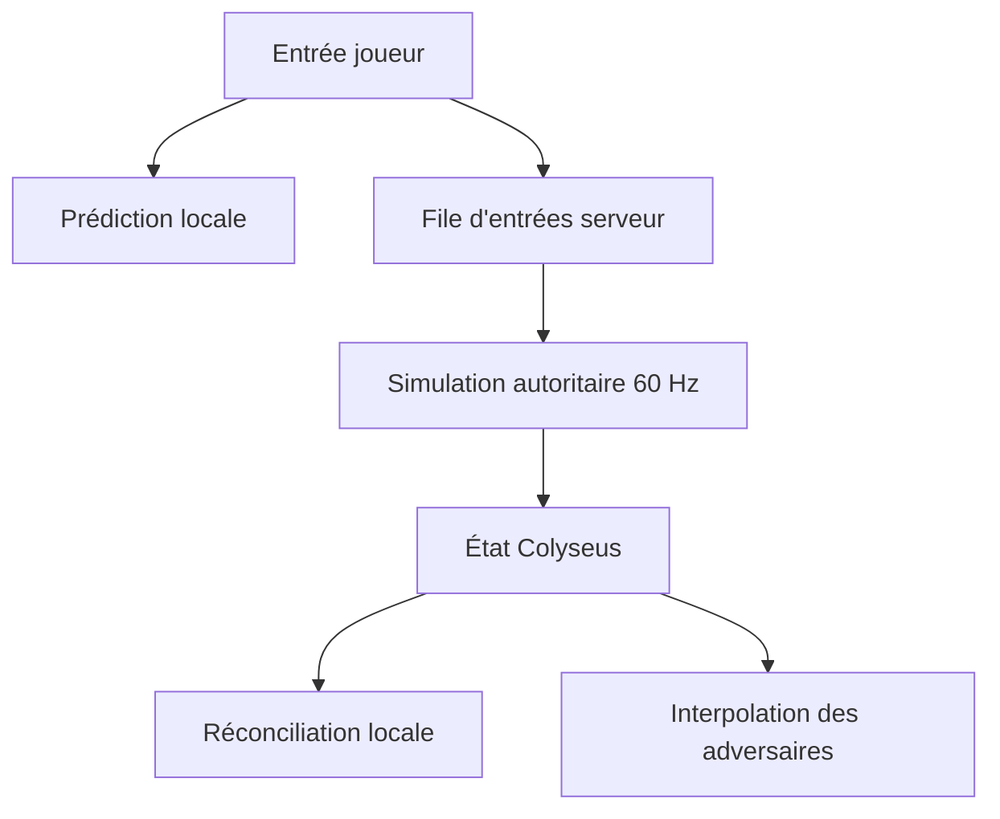

# Architecture réseau

## Principe

Le client ne transmet jamais sa position. Il envoie uniquement ses intentions de conduite numérotées. Le serveur valide ces entrées, exécute la simulation à 60 Hz et synchronise l'état résultant.

Le client local rejoue immédiatement les mêmes règles pour masquer la latence. Lorsqu'un état autoritaire arrive, il supprime les entrées déjà acquittées, repart de la position serveur et rejoue les entrées encore en attente.

Les autres pilotes sont interpolés vers leurs instantanés réseau afin d'éviter les mouvements saccadés.

## Limites du jalon

- Les collisions kart contre kart ne sont pas encore simulées.
- Le circuit empêche actuellement de sortir de la chaussée avec une pénalité de vitesse.
- La compensation de lag reste volontairement simple avant l'ajout des objets.
- Les comptes, le matchmaking classé et la persistance viendront après validation de la conduite.

