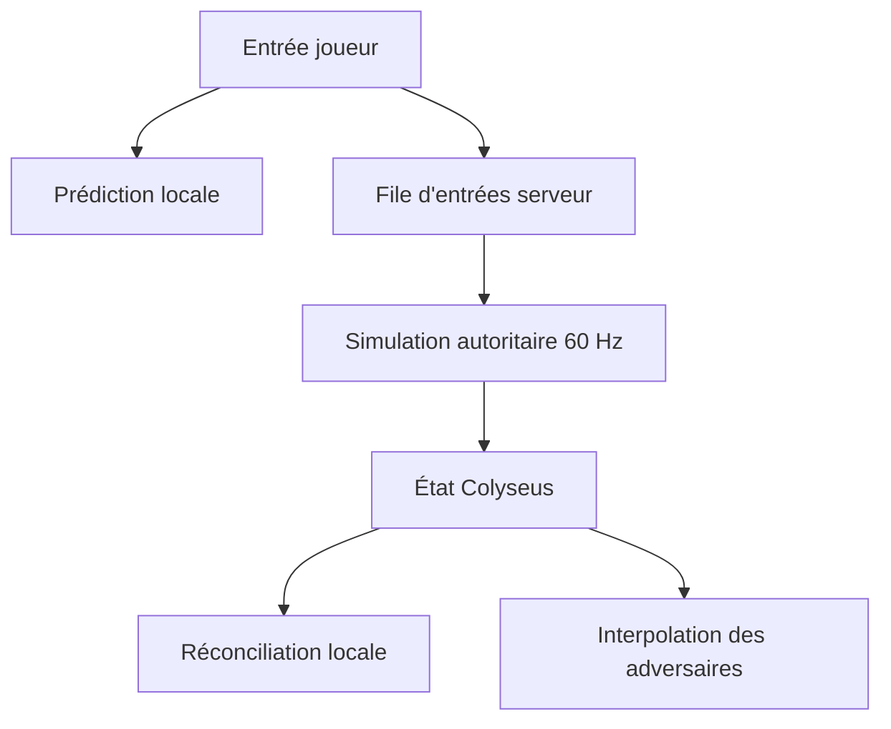

# Architecture réseau

## Principe

Le client ne transmet jamais sa position. Il envoie uniquement ses intentions de conduite numérotées. Le serveur valide ces entrées, exécute la simulation à 60 Hz et synchronise l'état résultant.

Le client local rejoue immédiatement les mêmes règles pour masquer la latence. Lorsqu'un état autoritaire arrive, il supprime les entrées déjà acquittées, repart de la position serveur et rejoue les entrées encore en attente.

Les autres pilotes sont interpolés vers leurs instantanés réseau afin d'éviter les mouvements saccadés.

Le serveur contrôle également les quatre phases d'une manche (`waiting`, `countdown`, `racing`, `results`). Les clients affichent le compte à rebours à partir du tick serveur et ne peuvent déplacer leur kart que pendant la phase `racing`.

Les passages de ligne ne suffisent pas à valider un tour : sept checkpoints intermédiaires doivent être franchis dans l'ordre. Les positions, collisions, temps d'arrivée et abandons sont eux aussi calculés par le serveur.

## Limites actuelles

- Le circuit empêche actuellement de sortir de la chaussée avec une pénalité de vitesse.
- Les collisions utilisent volontairement des volumes circulaires simples avant l'introduction de châssis aux comportements distincts.
- La compensation de latence reste volontairement simple avant l'ajout des objets.
- Les objets, pilotes contrôlés par l'IA et systèmes de réapparition ne sont pas encore implémentés.
- Les comptes, le matchmaking classé et la persistance viendront après validation de la conduite.
